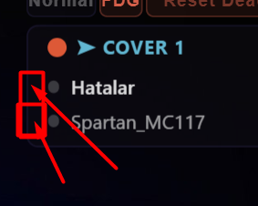

***Les status***

On supprime le système de mort actuel (on garde le help) et on crèe une icone

Position :

Status :
RDY - vert
DEAD - Rouge
WAIT - Orange

On supprime le raccourci de mort actuelle et il devient le raccourci de changement de statut. Et on fonctionne sur un système de cycle. On ajoute aussi un bouton pour le changement de statut dans la barre principale dans laquelle il y a les boutons de coupure des micros.